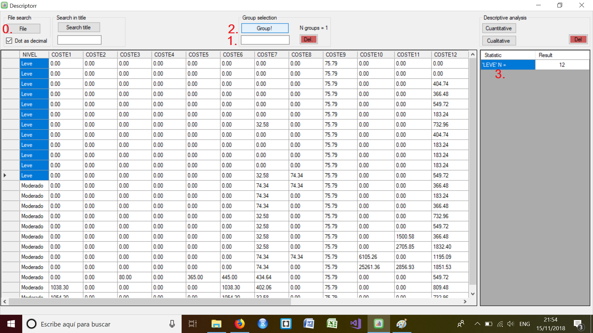
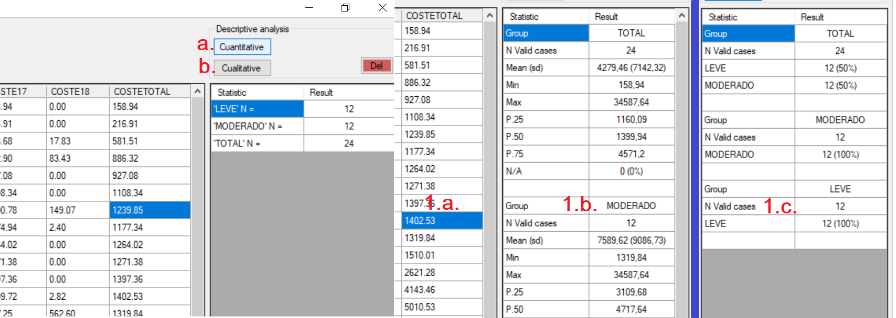

# Descriptive-DDBB-wizard
What is this: A wizard to perform descriptive analysis in databases

License: All **free** and **open** software.

--------

### How to use it:

Next image shows how the program looks when oppened a database file pressing **"0."** 
as shown, once is selected a specific group of rows of interest, we specify the name of the group by writing in **"1."** and setting it pressing **"2."**, basic group description **"3."** is displayed.

Once all groups are specified, column of interest is indicated by marking in any row of it as shown in the next figure in **"1.a."**.**"a."** will perform basic cuantitative descriptive analysis of selected row column (**"1.b"**) where P.X means the percentile X, being percentile 50 the median. **"b."** will perform basic cuantitative descriptive analysis.

--------
### Other info:

The objective of this proyect is making fast some time-consuming tasks relative to descriptive analysis.
